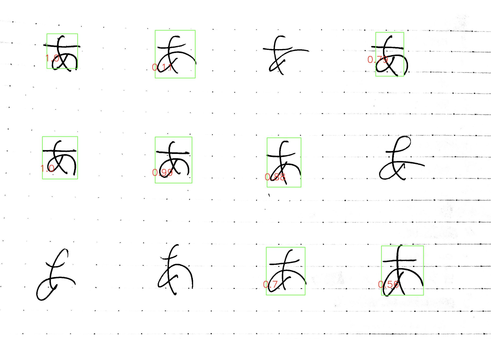
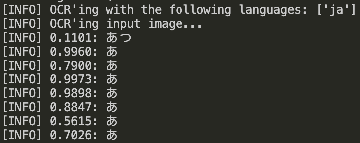

# handwriting-rating

## Description
 Rate Japanese handwriting using a custom EasyOCR model. 

 Currently using default japanese_g2, which is trained on non-handwritten text. 
 
 Code based off tutorial from <a href="https://talcgames.itch.io/](https://www.youtube.com/watch?v=fGP_sSo-usc" target="_blank" rel="noopener noreferrer">PyImageSearch</a>

## Dataset/Model
 <a href="https://jaided.ai/easyocr/modelhub/" target="_blank" rel="noopener noreferrer">Default EasyOCR japanese_g2 model</a>

## Usage
 python3 character_accuracy.py --image images/1.png --g 1 --langs ja --kana 1 

 --image specify image
 
 --g if gpu should be used 1 or -1
 
 --langs specify languages, normally just use ja
 
 --kana if kana should be used, 1 or -1

 Tthe text needs to be spread out if you want individual ratings on each character. Additionally, very poorly written ones will likely not be rated at all, support for specific character recognition will be added soon. The downside right now is that in the event a character just can't be recognized, it will be recognized incorrectly, given a wrong rating, or it won't be rated at all.

 ## Result
  Draws bounding boxes with confidence numbers (essentially a score on your writing) over text. 

  Returns list of text and confidence values in terminal. 

 ## Currently working on...
  Custom EasyOCR model trained on actual handwriting data

  Specific character support for more clear feedback.

  Integration with  <a href="https://github.com/theoc3/JapanesePractice" target="_blank" rel="noopener noreferrer">Practice python script</a>, so individual characters can be tested for exact confidence levels on an assigned character

  Detected text written onto image (OpenCV does not natively support)

  More detailed feedback information in the console. 

  
 

