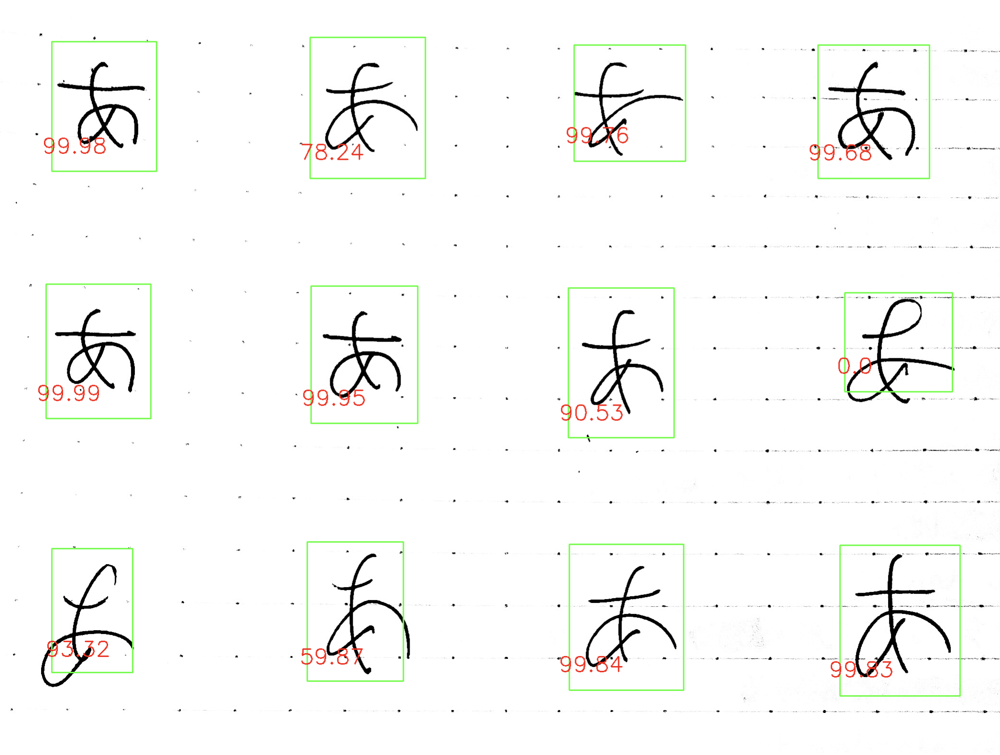
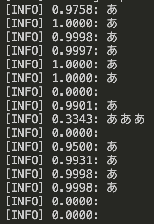

# handwriting-rating

## Description
 Rate Japanese handwriting using a custom EasyOCR model. 

 Currently using default japanese_g2, which is trained on non-handwritten text. 
 
 Code based off tutorial from <a href="https://talcgames.itch.io/](https://www.youtube.com/watch?v=fGP_sSo-usc" target="_blank" rel="noopener noreferrer">PyImageSearch</a>

## Dataset/Model
 <a href="[https://github.com/Nexdata-AI/101-People-4538-Images-Japanese-Handwriting-OCR-Data](https://jaided.ai/easyocr/modelhub/)" target="_blank" rel="noopener noreferrer">Default EasyOCR japanese_g2 model</a>

## Usage
 python3 character_accuracy.py --image images/1.png --g 1 --langs ja --kana 1 

 --image specify image
 
 --g if gpu should be used 1 or -1
 
 --langs specify languages, normally just use ja
 
 --kana if kana should be used, 1 or -1

 ## Result
  Draws bounding boxes with confidence numbers (essentially a score on your writing) over text. 

  Returns list of text and confidence values in terminal. 

 ## Currently working on...
  Custom EasyOCR model trained on actual handwriting data

  Integration with  <a href="https://github.com/theoc3/JapanesePractice" target="_blank" rel="noopener noreferrer">Practice python script</a>, so individual characters can be tested for exact confidence levels on an assigned character

  Detected text written onto image (OpenCV does not natively support)

  
 

